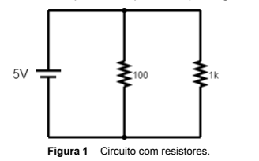

# 📘 Lista de Exercícios – Circuitos Eletrônicos (Aula 01)

## 🔹 Exercício 01 – Circuito com Resistores

### 1. Link da simulação
https://www.falstad.com/circuit/

### 2. Cálculo da tensão e corrente no resistor de 1kΩ

Lei de Ohm:
V = R * I

Resistência equivalente:
Req = R1 + R2 + ...

Corrente total:
I = Vfonte / Req

Tensão no resistor de 1k:
V1k = R1k * I

---

### 3. Medição no simulador

- Amperímetro ligado em série com o resistor de 1k  
- Valor medido: ________

---

### 4. Comparação

O valor medido foi:

- ( ) Igual  
- ( ) Muito próximo  
- ( ) Diferente  

Justificativa:  
Em simuladores ideais, os valores tendem a ser praticamente iguais aos calculados.

---

### 5. Circuito real vs simulado

Não seria exatamente igual, pois:

- Resistores possuem tolerância (ex: ±5%)
- Fios têm resistência
- Instrumentos de medição influenciam o circuito
- Fonte pode não ser ideal

---

## 🔹 Experimento 02 – Circuito RC

### 1. Link da simulação
Cole aqui o link.

---

### 2. Constante de tempo (τ)

τ = R * C

Exemplo:
τ = 220k * 10uF = 2,2 s

---

### 3. Tempo para atingir 1,9V

Tempo medido no simulador: ________

---

### 4. Discussão

#### a) Comparação com τ

Em um circuito RC:
V(t) = Vfinal * (1 - e^(-t/τ))

Em 1τ, o capacitor atinge aproximadamente 63% da tensão final.

---

#### b) Alterando para 100kΩ

τ = R * C

Se R diminui → τ diminui

Resultado:
O capacitor carrega mais rápido.

---

### 5. Descarga do capacitor (posição B)

Equação:
V(t) = V0 * e^(-t/τ)

Explicação:
- O capacitor libera energia armazenada
- A corrente diminui com o tempo
- A tensão tende a 0V

---

## ✅ Conclusão

- Circuitos resistivos seguem a Lei de Ohm  
- Circuitos RC apresentam comportamento exponencial  
- A constante de tempo τ controla a velocidade de carga e descarga  