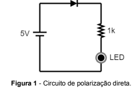
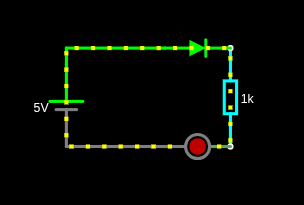
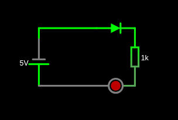
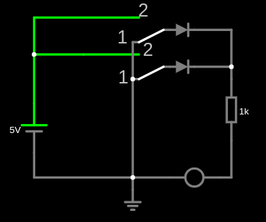
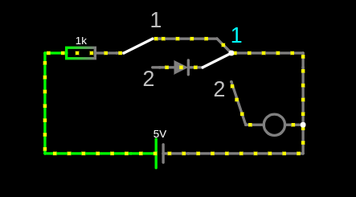

# 📘 Roteiro de Laboratório 02 – Circuitos com Diodo

## 🎯 Objetivos

- Diferenciar polarização direta e reversa de diodos  
- Empregar diodos na construção de portas lógicas  

---

## 🔹 Experimento 01 – Polarização direta vs reversa de diodos

### 1. Simulação

[text](https://www.falstad.com/circuit/circuitjs.html?ctz=DwYwlgTgBAZgvAIgIwKgFwM6IAwDpsEECsqYIOuRAnDQCy0DMATEtrQGwDsAHEp6iABGiItlQAHYQkaoAbhBGoAtphEBTALRIUAPgBQUKMFlQAHoj7soDNlEtQmTWqnjJ2qAO6uxUJQENTWUUAen1DYGhzBAYGKxtaa1iHbG4XHFQFZEIEUIMjABkAUQARM0QYuNsmTiZrNjSEHyUAe0QAEzUYPwBXABs0DV61NoFMlCgQAHN0iakmwXJG-BRc8LayhGraphTEqx3U2BmW9s6e-pywow8NrbqE+3iGsVXr25rk7jtOfZTny7ywBuUXsjgeP0+-1ywGC4Ag+iAA)

---

### 2. Tensão no resistor de 1k

Valor medido: 2,835 V

Explicação: A uma queda de tensão no diodo e no led o ressitor fica com o resto da tensão depois da queda desses dois.

---

### 3. Cálculo da corrente no resistor de 1k

Dados:
- Vfonte = 5V  
- VLED = 1,7V  
- VDiodo = 0,7V  

Tensão no resistor:
V = 5 - 1,7 - 0,7

Corrente:
I = V / R

Resultado: 2,6mA

Comparação com simulação: 2,835mA
---
Não foi igual devio que a queda de tensão medido nos componentes é diferente do que a questão indicou, mas ficou um pouco próximo.

### 4. Link da simulação

[Link para a simulação](https://www.falstad.com/circuit/circuitjs.html?ctz=DwYwlgTgBAZgvAIgIwKgFwM6IAwDpsEECsqYIOuRAnDQCy0DMATEtrQGwDsAHEp6iABGiItlQAHYQkaoAbhBGoAtphEBTALRIUAPgBQUKMFlQAHoj7soTJrSiWoDNqnjJ2qAO6uxUJQENTWUUAen1DYGhzBAYGKyc7GKsmbG4XHFQFZEIEUIMjABkAUQARM0RExzZrTiZK2jSEHyUAe0QAEzUYPwBXABs0DV61NoFMlCgQAHN0iakmwXJG-BRc8LayhCYa6xTHWJ3U2BmW9s6e-pywow8Nrdr4+0445yPGy7zgG6i7g8eklIaYlW1w2DhsdjBANeQP0wGC4Ag+iAA)

---

### 5. Diferença entre os dois circuitos

O Led está apagado! O diodo impede a passagem da coorente impedindo que o LED acenda, pois o circuito está com polarização reversa.

---

### 6. Circuito sem diodo

Comportamento observado: O LED permaneceu apagado!

Justificativa: Porque o LED é um diodo também e como a polarização está reversa no circuito ele impede a corrente de passar.

---

### 7. Simulação com fonte CA

Configuração:
- Sinal senoidal  
- 5V de pico  
- Frequência: 1Hz  

#### a) Comportamento do LED

Ele pisca a cada aproximadamente 1s

---

#### b) Tensão no resistor na parte negativa

A tensão do resistor tende a zero porque está porque o diodo fica polarizado reversamente impedindo a passagem da corrente no circuto
---

## 🔹 Experimento 02 – Portas lógicas com diodos

### 1. Link da simulação
[Link para a simulação](https://www.falstad.com/circuit/circuitjs.html?ctz=DwYwlgTgBAZgvAIgIwKgFwM6IAwDpsEECsqYIiAzABwBMuA7AGw1G1IAsFAnF9o+6hAAjREWyoADiISdUANwijUAW0yiApgFokKAHwAoKFGByoAD0Q6aUGlSpQrNmgNiXGqAO7wE4qMoCGZnJKAPQGRsDQFggUjPZIXNax9jT0NKjevorIhAhhhsYAMgCiACLmlERJNNg2dlAUNRk4KgD2iAAm6jD+AK4ANmia-eodgtkoUCAA5i1T0r7KQuQ++Cj5ER0VCLbxTA01DkzNPm2d3X2DeeHGW9G7DrYHtUi2J4vtCF09A2jXBcBpttnLUKLEbOxQVV3v8IgBlYH1V4pSGPKgwqD9MBzNAAC0Q6Q2xg820cNGcDleDkYvkysOJpKpSBpR0Y1NpLSJwBJ0UczJeTNeMK5PMohyQ+2SrOFN2520aLyeUuRMoBopicTRDU1EvcrlOIvlOslOsSqoi6rJSKpCvNDN5NsOIOedrl91RCrq9lt+vEhvdoPBzp9dP9lWqoM1Ic5svVUs9UtS6V99OACPuSP2zt1GKxOPxO1T6uzgusVldlv2-IhLxpFeBHqdqISydDsYbL0SNYc7BcbYBZgb9EpSBsLJ0fbmGGxOxcaHUBNTg-uNFHCRSFHYNmwkzpUGnBLnC+QS+B4vYbJoYJ7XAxB9nqHnllP9yIFGp1hojDZzJIKf3M7OI+x6EgYwAhOAEAGEAA)

---

### 2. Identificação da porta lógica

- SW1 e SW2:
  - Posição 2 → nível lógico 1 (5V)  
  - Posição 1 → nível lógico 0 (0V)  

Porta lógica identificada: Porta Lógica OR

---

### 3. Link da simulação
[Link para a simulação](https://www.falstad.com/circuit/circuitjs.html?ctz=DwYwlgTgBAZgvAIgIwKgFwM6IAwDpsEECsqYIiAzABwBMuA7AGw1G1IAsFAnF9o+6hAAjREWyoADiISdUANwijUAW0yiApgFokKAHwAoKFGByoAD0o1sUGvRo2ijG3dTxkjVAHc34qMoCGZnJKAPQGRsDQFu7WSIzWNOyx8a44qIrIhAhhhsYAJuaINFRUUEhMUBQUTuUesGl+APaIeeow-gCuADZo2eHGAMqFCInJCSVlKfUIvl1gDWgAFkV9ucBD0VU1FdWltakzqHMLyyOrEQAyAKIAIsPU7DZJUOzspaMHvsrNCK3t3WhNF11HlBBkUFAQABzBrCBrKITkGb4FA5CKeYbFPavSpEewcATTcRo4wYzaMPbxXH416fc6k4avd7PJllJh0knAMmUCmTaysuK+Hz0rmMt5spwCqbCznchC7MpcewPJ5CtKy+5WZz2Vm2Ggc-qi6K6uwvcUfIkiuUsJx6vnag1rOWC7X2wWOiJme7m7ClapIGw6OlQDDzEaEtDqFacr3RGiMLiK+g2Wg2AjB0NFCNRs4xzH0ZNICgBmi8MoUQnCkNhxKoSOIVGG2M8wvi6ixIgQquZ8N1nON-TAELgCAGIA)

---

### 4. Identificação da porta lógica

Porta lógica identificada: Porta Lógica AND

---

## ✅ Observação

- Utilizar diodos modelo "default"  
- Utilizar LEDs vermelhos modelo "default-led"  
