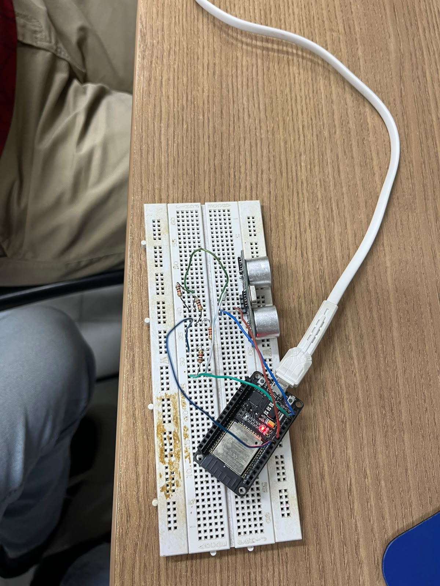
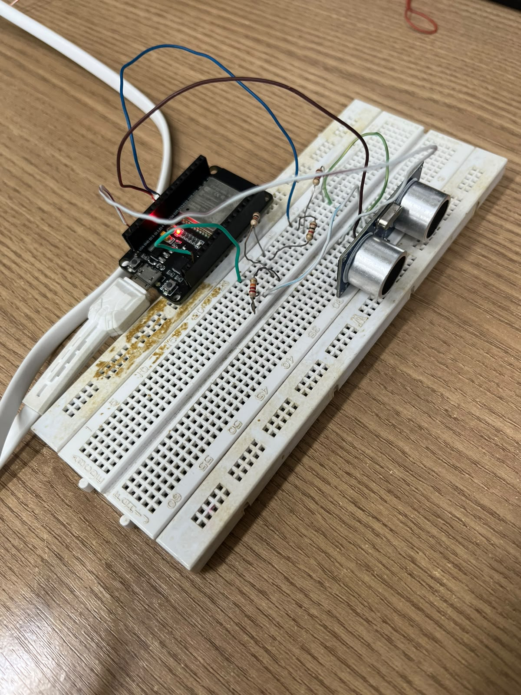

# Relatório 02 – Atividade HIoT_08


## 1. Objetivo da prática

- Implementar um circuito com sensor ultrassônico HC-SR04;
- Configurar a ESP32 para enviar e receber sinais do módulo;
- Calcular a distância em centímetros com base no tempo de propagação do som;
- Exibir os valores no monitor serial;
- Validar o funcionamento da montagem com testes práticos.

---

## 2. Materiais utilizados

- Placa ESP32;
- Sensor ultrassônico HC-SR04;
- Breadboard;
- Jumpers;
- Cabo USB para alimentação/programação;
- Resistor
- Computador com Arduino IDE / ambiente de desenvolvimento para gravação do código.

---

## 3. Montagem do circuito

O sensor HC-SR04 foi conectado à ESP32 conforme a lógica do código implementado:

- `trigPin = 27`;
- `echoPin = 26`;
- alimentação do sensor de acordo com a tensão correta do módulo;
- aterramento comum entre ESP32 e sensor.

A placa foi montada em protoboard e o sensor foi posicionado no lado direito do circuito, como pode ser observado nas imagens abaixo.

### Imagens da montagem






## 4. Código desenvolvido

Arquivo principal da prática:

[ código-atividade-HIoT__08.ino ](codigo-atividade-HIoT__08.ino)

```cpp
const int trigPin = 27;
const int echoPin = 26;

#define SOUND_SPEED 0.034 // cm/uS

const float DISTANCIA_MAXIMA = 400.0;

long duracao;
float distanciaCM;

void setup() {
  pinMode(trigPin, OUTPUT);
  pinMode(echoPin, INPUT);
  Serial.begin(115200);
}

void loop() {
  digitalWrite(trigPin, LOW);
  delayMicroseconds(2);
  digitalWrite(trigPin, HIGH);
  delayMicroseconds(10);
  digitalWrite(trigPin, LOW);

  duracao = pulseIn(echoPin, HIGH);

  distanciaCM = duracao * SOUND_SPEED / 2;

  if (distanciaCM > DISTANCIA_MAXIMA || distanciaCM < 2.0) {
    distanciaCM = 0;
  }

  Serial.print("Distância: ");
  Serial.print(distanciaCM);
  Serial.println(" cm");

  delay(1000);
}
```
## 9. Vídeo da prática

[Link do vídeo da prática](https://www.youtube.com/watch?v=eJ_b-dguJUE)

---

## 10. Arquivos relacionados

- [PDF da atividade](HIoT_08.pdf)
- [Código da prática](codigo-atividade-HIoT__08.ino)
- [Imagem da montagem](image.png)
- [Imagem da bancada](image copy.png)
- [Imagem adicional](Imagem01.jpeg)

